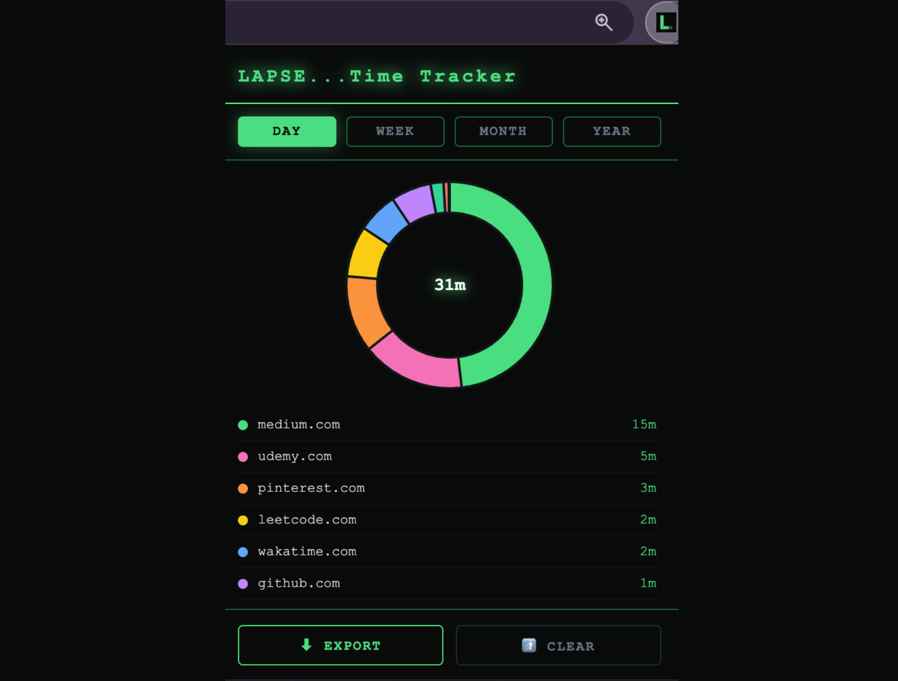

# 🕰️ LAPSE...Time Awareness for Your Browser

> Take back your time ⏳. LAPSE shows you exactly where your hours go online so you can browse with intention next time!

## ✦ What is LAPSE?

LAPSE is a Chrome extension that silently tracks how much time you spend on each website and visualizes it as a beautiful pie chart. No accounts, no servers, no data leaving your machine. Everything stays local 😉.

Built as a learning project to explore Chrome Extension APIs, service workers, and data visualization...but designed and shipped as a real product 💝.

## ✦ Features

- 🔍 **Automatic tracking**: starts the moment you open Chrome, no setup needed
- ⏸️ **Smart pausing**: stops counting when you switch apps, lock your screen, or go idle
- 📅 **Daily, weekly, monthly, yearly views** : see your habits at every scale
- 👩🏽‍💻 **Beautiful UI** : terminal-inspired dark theme with a spring color chart
- 📤 **Export your data** : download everything as JSON
- 🔒 **Privacy first** : all data stored locally using chrome.storage.local, never sent anywhere

## ✦ Installation

LAPSE is not yet on the Chrome Web Store. To install it locally:

1. Clone this repo
2. Open Chrome and go to `chrome://extensions/`
3. Enable **Developer mode**
4. Click **Load unpacked** and select the `lapse/` folder
5. Pin the extension to your toolbar and start browsing

## ✦ Tech Stack

- **Chrome Extensions Manifest V3**
- **Vanilla JavaScript**: no frameworks
- **Chart.js**: pie chart visualization
- **chrome.storage.local**: persistent local storage
- **chrome.alarms**: midnight cleanup scheduling
- **chrome.idle**: idle and focus detection
- **CSS**: custom terminal theme, no Tailwind or UI libraries

## ✦ Ideas for future versions

- [ ] 🎨 Theme picker: amber, blue, rose variants, etc
- [ ] 🎯 Daily time goals with alerts
- [ ] 📊 CSV export
- [ ] 🏪 Chrome Web Store release

## ✦ The Story Behind LAPSE

> `$ git log --since="last summer ☀️" --author="code_techhb 👩🏽‍💻"`
> `> 1 commit found: "stop losing track of time, build the thing 😬"`
> `> runtime: 8 months 😭 | status: finally shipped 😅`

## ✦ License

MIT
